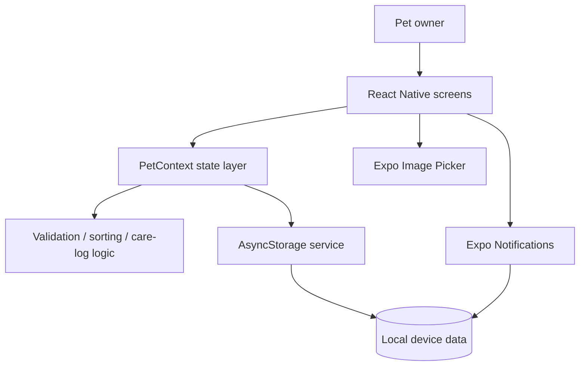

# PetCare

[](https://github.com/Robert-Pelot/PetCare/actions/workflows/ci.yml)
[](https://reactnative.dev/)
[](https://www.typescriptlang.org/)
[](LICENSE)

<p align="center">
  
</p>

PetCare is a mobile organizer for keeping a pet's everyday information in one place. It supports multiple pet profiles, care logs, medical notes, feeding instructions, grooming details, and appointment reminders.

This repository is a cleaned and modernized portfolio edition of my final project for IST 236 (Mobile Application Development) in 2025. The original course version demonstrated the core idea; this edition rebuilds it with current dependencies, TypeScript, safer local data handling, automated tests, and continuous integration.

**Portfolio:** [Life in Your 50s — Projects](https://mystorageaccountusasa.z13.web.core.windows.net/projects.html)

## 30-second overview

| | |
|---|---|
| **Problem** | Keep everyday pet care, medical, feeding, grooming, and appointment information together |
| **Stack** | React Native, Expo, React, TypeScript |
| **State & persistence** | React context plus AsyncStorage on the device |
| **Device features** | Camera/photo library and local notifications |
| **Quality** | Jest tests, ESLint, strict TypeScript checks, GitHub Actions CI |
| **Privacy model** | Local-first; no shared cloud account or API key required |

## Architecture



The application intentionally keeps pet records on the device. There is no shared remote database, account service, or required cloud credential in the portfolio version.

## What this demonstrates

- React Native mobile application development
- TypeScript data modeling and safer state handling
- Multi-screen navigation with React Navigation
- Shared application state through React context
- Local persistence with AsyncStorage
- Camera and photo-library integration
- Local appointment reminders with Expo Notifications
- Domain logic separated from UI code
- Unit testing of validation, date handling, sorting, reminder calculations, and care-log grouping
- Automated linting, type checking, testing, dependency auditing, and web bundling in CI

## Key features

- Create, edit, switch between, and delete pet profiles
- Add a pet photo from the camera or photo library
- Record walks, feedings, and custom care events
- Maintain dated medical-history entries
- Store breakfast, lunch, dinner, medication, snack, and treat instructions
- Keep grooming instructions and provider contact information
- Schedule veterinary and grooming appointments
- Request notification permission only when a reminder can actually be scheduled
- Persist data locally on the device

## Design decisions and tradeoffs

### Local-first instead of shared Firebase

The classroom version connected every installation to one shared Firebase path without user authentication. That was useful while learning Firebase, but it was not an appropriate architecture for a public portfolio application containing personal pet information.

The portfolio edition therefore stores each installation's data locally, requires no account or API key, and does not transmit pet information to a remote service.

That choice improves privacy and makes the repository easy to run, but it also means there is currently no multi-device synchronization or cloud backup.

### Domain logic outside the screens

Validation, calendar-date checks, sorting, upcoming-appointment selection, reminder calculations, and care-log grouping live in domain code rather than being buried inside screen components. That makes the behavior easier to test and maintain.

### Permissions are feature-driven

Camera, photo-library, and notification permissions are requested only when the user selects a feature that needs them rather than at application startup.

## Technology

- Expo SDK 57 and React Native 0.86
- React 19 and TypeScript 6
- React Navigation 7
- Expo Image Picker and Expo Notifications
- AsyncStorage for on-device persistence
- Jest with `jest-expo`
- ESLint and strict TypeScript checks
- GitHub Actions continuous integration
- Dependabot monitoring for npm and GitHub Actions updates

## Getting started

### Prerequisites

- Node.js 24
- npm
- Expo Go on a supported mobile device, or an Android/iOS development environment

### Install and run

```bash
git clone https://github.com/Robert-Pelot/PetCare.git
cd PetCare
npm ci
npm start
```

After Expo starts, scan the QR code with Expo Go or use one of these commands:

```bash
npm run android
npm run ios
npm run web
```

Camera behavior and local notifications are best evaluated on a physical device. The web build is included as a portability and bundling check; browser support for native features varies.

## Quality checks

Run the complete local verification suite:

```bash
npm run check
```

Or run each check independently:

```bash
npm run lint
npm run typecheck
npm run test:ci
npx expo export --platform web
```

The unit suite covers profile normalization and validation, real calendar-date validation, non-mutating appointment sorting, upcoming appointment selection, reminder calculations, and care-log grouping. GitHub Actions repeats linting, type checking, testing, a high-severity dependency audit, and a production web bundle on every pull request and every push to `main`.

## Project structure

```text
PetCare/
├── .github/workflows/ci.yml    # Automated verification
├── assets/                     # Expo application artwork
├── src/
│   ├── components/             # Reusable interface components
│   ├── context/                # Pet state and persistence coordination
│   ├── domain/                 # Validation, sorting, and care-log logic
│   ├── screens/                # Application screens
│   ├── services/               # Storage and notification adapters
│   ├── theme.ts                # Shared colors and spacing
│   └── types.ts                # Application and navigation types
├── App.tsx                     # Navigation and providers
└── app.json                    # Expo configuration and permissions
```

## Privacy and permissions

PetCare requests permissions only in response to a feature the user selects:

- Camera access: taking a pet profile photo
- Photo-library access: choosing a pet profile photo
- Notification access: scheduling an appointment reminder

All profile and care data remains in the app's local device storage. The repository contains no credentials, connection strings, or private user data.

## Current limitations

- Records do not synchronize between devices.
- There is no account system or cloud backup.
- Local photo URIs depend on operating-system storage behavior.
- Notification delivery depends on device settings and platform restrictions.
- The app has been statically verified and web-bundled in CI; final camera and notification checks require a physical Android or iOS device.

## License

This project is available under the [MIT License](LICENSE).
